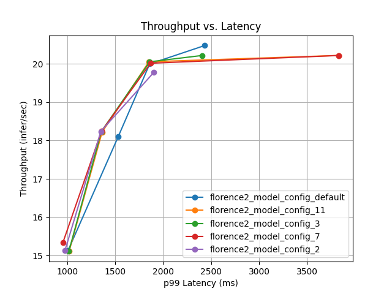
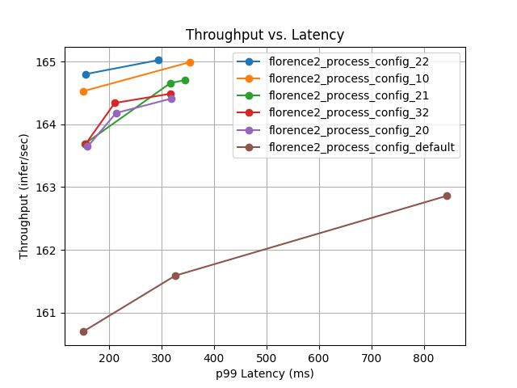

# Florence-2
This is an ensemble deployment of the [Florence-2-large-ft](https://huggingface.co/mrhendrey/Florence-2-large-ft-safetensors) model. This is a vision model that has
been finetuned for the following task prompts:

* "\<CAPTION>"
* "<DETAILED_CAPTION>"
* "<MORE_DETAILED_CAPTION>"
* "<CAPTION_TO_PHRASE_GROUNDING>"
  * This takes an additional text prompt to do the grounding, e.g., "A cyclist holding a sign"
* "\<OD>" (Object Detection)
* "<DENSE_REGION_CAPTION>"
* "<REGION_PROPOSAL>"
* "\<OCR>"
* "<OCR_WITH_REGION>"

The output returned will be a JSON string that depends upon the task prompt given.

## Example Request
An image is submitted as a base64 encoded string.

```
import base64
import json
import requests
from uuid import uuid4

base_url = "http://localhost:8000/v2/models"

image_path = "/path/to/your/image.png"
with open(image_path, "rb") as f:
    image_bytes = f.read()
image_b64 = base64.b64encode(image_bytes).decode("UTF-8")

task_prompt = "<CAPTION>"

inference_request = {
    "id": uuid4().hex,
    "inputs": [
        {
            "name": "INPUT_IMAGE",
            "shape": [1, 1],
            "datatype": "BYTES",
            "data": [image_b64],
        },
        {
            "name": "TASK_PROMPT",
            "shape": [1, 1],
            "datatype": "BYTES",
            "data": [task_prompt],
        }
    ]
}
response = requests.post(
    url=f"{base_url}/florence2/infer",
    json=inference_request,
).json()
result = json.loads(response["outputs"][0]["data"][0])
print(result)
# {'<CAPTION>': 'A woman holds up a sign that reads "safe streets now."'}
```

## Sending Many Images
If you need to send multiple images, it's important that you send each image request
separately and using multiple threads to ensure optimal throughput.

NOTE: You will encounter an OSError "Too many open files" if you send a lot of
requests. Typically the default ulimit is 1024 on most systems. Either increase this
using `ulimit -n {n_files}`, or don't create too many futures before you process them
as they are completed.

```
from concurrent.futures import ThreadPoolExecutor, as_completed
import base64
import json
from pathlib import Path
import requests
from uuid import uuid4

def inference_request(image_path, task_prompt, text_prompt=None):
    image_b64 = base64.b64encode(image_path.read_bytes()).decode("UTF-8")
    request = {
        "id": uuid4().hex,
        "inputs": [
            {
                "name": "INPUT_IMAGE",
                "shape": [1, 1],
                "datatype": "BYTES",
                "data": [image_b64],
            },
            {
                "name": "TASK_PROMPT",
                "shape": [1, 1],
                "datatype": "BYTES",
                "data": [task_prompt],
            }
        ]
    }
    if text_prompt:
        request["inputs"].append(
            {
                "name": "TEXT_PROMPT",
                "shape": [1, 1],
                "datatype": "BYTES",
                "data": [text_prompt],
            }
        )
    return request

base_url = "http://localhost:8000/v2/models"

task_prompt = "<CAPTION>"
input_dir = Path("/path/to/image/directory/")
futures = {}
results = {}
with ThreadPoolExecutor(max_workers=4) as executor:
    for path in input_dir.iterdir():
        if path.is_file():
            future = executor.submit(
                requests.post,
                url=f"{base_url}/florence2/infer",
                json=inference_request(path, task_prompt, text_prompt=None),
            )
            futures[future] = str(path.absolute())
    
    for future in as_completed(futures):
        try:
            response = future.result().json()
        except Exception as exc:
            print(f"{futures[future]} threw {exc}")
        else:
            path = futures[future]
            try:
                parsed_json = json.loads(response["outputs"][0]["data"][0])
                results[path] = parsed_json
            except Exception as exc:
                print(f"{path} failed to get response: {exc}")

```

## Model Analyzer
Included in the Triton Inference Server SDK container is the model-analyzer CLI. This
uses the perf_analyzer to help you find optimal configurations to maximize for your
GPU.

This is my first foray into using this utility and some difficulty getting it to work
well with an ensemble configuration like we are using in this model repository.

### Model Analyzer on florence2_model and florence2_process
Let's start with getting configurations optimized for the two underlying key components
of the ensemble, namely, florence2_model (GPU workload) and florence2_process (CPU workload).
These will be done using the same [yaml script](../model-analyzer-both.yaml).

For now, I'm using triton remotely which means that you need to have the service up and
running for model-analyzer to see. There are two other options, local & docker, but
I couldn't get those to work for now.  Pressing on!

Start the SDK container by running:

```sh
docker run --rm -it --net host \
  -v ./:/workspace/triton-florence2 \
  nvcr.io/nvidia/tritonserver:24.10-py3-sdk
```

Once inside the SDK container you can start the model-analyzer with:

```sh
model-analyzer profile \
  --model-repository triton-florence2/model-repository/ \
  --triton-launch-mode=remote \
  --output-model-repository-path triton-florence2/model-analyzer-output/brute_both \
  -f triton-florence2/model-analyzer-both.yaml
```

Take a look at the [model-analyzer-both.yaml](../model-analyzer-both.yaml). This will use
a brute force search across the following combinations of configurations

* florence2_process (36 total configurations)
  * max_batch_size: [6, 12, 24, 36]
  * max_queue_delay_microseconds: [0, 100, 200]
  * instance counts: [2, 3, 4]
* florence2_model (12 total configurations)
  * max_batch_size: [6, 12, 24, 36]
  * max_queue_delay_microseconds: [0, 100, 200]

When the model-analyzer is finished, it generates both a detailed and summary reports for the top configurations that it found. The [PDF reports](../model-analyzer-reports/) have been copied into the repo for convenience.

### Results for GPU Workload
The top three results had the following throughput for the different levels of concurrency [12:60:12].



| Configuration | Throughput | max_batch_size | max_queue_delay_microseconds |
|--------------:|:----------:|:--------------:|:----------------------------:|
| **config_default**  | **20.4761**|    **36**      |             **0**            |
| config_11     | 20.2189    |      36        |              200             |
| config_3      | 20.2184    |      36        |               0              |
| config_7      | 20.2180    |      36        |              100             |
| config_2      | 19.7727    |      24        |               0              |

### Results for CPU Workload
The top three results had the following throughput for the different levels of concurrency [12:60:12].



| Configuration  | Throughput  | max_batch_size | max_queue_delay_microseconds | Instance Count |
|---------------:|:-----------:|:--------------:|:----------------------------:|:--------------:|
| config_22      | 165.025     |      24        |            100               |      4         |
| config_10      | 164.992     |      24        |             0                |      4         |
| config_21      | 164.708     |      12        |            100               |      4         | 
| config_32      | 164.488     |       6        |            200               |      4         |
| config_default | 162.862     |      36        |             0                |      4         |


### Config Selection
When using the ensemble backend, the batch size must match each other. Given that there is very little difference on the CPU workload (as expected), we will set the configuration of florence2_model to match that of config_default.

## Performance Analysis
The throughput performance is highly task dependent with some tasks taking much longer
than others. The ones that have regions (OD, OCR_WITH_REGION, etc.) can take
significantly longer depending on the number of objects in the image.

I use the following image during performance testing. As you can see, it has a lot of objects which will greatly affect throughput on tasks that get regions.


There is some sample data in [data/](../data/) directory. 

Launch the Triton Inference Server SDK container 

```sh
docker run \
  --rm -it --net host \
  -v ./:/workspace/triton-florence2 \
  nvcr.io/nvidia/tritonserver:24.10-py3-sdk
```

Inside the container, run the perf_analyzer CLI

```sh
perf_analyzer \
    -m florence2 \
    -v \
    --measurement-mode time_windows \
    --measurement-interval 60000 \
    --concurrency-range 36 \
    --input-data triton-florence2/data/load_data_CAPTION.json
```

| Task | Concurrency | Throughput (infer/s) | Ave. Latency (s) |
| ---- | ----------- | -------------------- | ------------ |
| \<CAPTION> | 36 | 26.6 | 1.35 |
| \<DETAILED_CAPTION> | 36 | 14.5 | 2.45 |
| \<MORE_DETAILED_CAPTION> | 36 | 19.6 | 1.83 |
| \<CAPTION_TO_PHRASE_GROUNDING> | 36 | 29.7 | 1.21 |
| \<OD> | 36 | 5.8 | 6.13 |
| \<DENSE_REGION_CAPTION> | 36 | 7.3 | 4.90 |
| \<REGION_PROPOSAL> | 36 | 6.3 | 4.72 |
| \<OCR> | 36 | 29.4 | 1.22 |
| \<OCR_WITH_REGION> | 36 | 21.6 | 1.66 |

## Validation
To validate this implementatin of the Florence-2 model, we calculate a few metrics that
correspond with the CAPTION task and compare the results against those published in the
[paper](https://arxiv.org/abs/2311.06242) and also against some of the metrics reported
in the [MS COCO paper](https://arxiv.org/pdf/1504.00325) paper for human performance
(See Table 1) for the [MS Coco 2014 Validation Data](https://cocodataset.org/#download).

This validation code is not quite as nicely contained as I would have liked so I'll
describe the process.

### Download Data
From the [COCO](https://cocodataset.org/#download) you can download the validation
images:

* [2014 Val images](http://images.cocodataset.org/zips/val2014.zip) (6GB)

### Clone coco-caption Repository
Clone the forked [COCO-Caption Repository](https://github.com/mtanti/coco-caption)
which has been updated for Python 3. This repo makes it easy and consistent to
calculate various metrics to compare the captions generated by Florence-2 with the
ground truth captions of the COCO 2014 Validation Dataset.

### Create Captions Using Florence-2
After starting Triton Inference Server, run the code to create the results file
[edit filepaths as needed]

```sh
cd model-repository/florence2
python validate.py \
    --coco-caption-dir "~/git/coco-caption" \
    --data-dir "~/data/ms_coco_2014/val2014"
```

On an RTX 4090 GPU, the 40,504 images in the validation dataset are captioned in 26mins
20 seconds. This equates to processing 25.6 images / second. The results file,
florence2_captions.json, is written to the `coco-caption/results` directory. This file
will be compared to the `coco-caption/annotation/captions_val2014.json` ground truth
captions in the next step.

### Calculate Metrics
The COCO-Caption repo makes it simple to calculate various metrics to compare the
Florence-2 generated caption against the validation data set.  Change directory to the
root of the repository and then run the following script.

```python
import argparse
from pathlib import Path
from pycocotools.coco import COCO
from pycocoevalcap.eval import COCOEvalCap


def parse_cmd_line():
    parser = argparse.ArgumentParser(description="COCO Caption Evaluation")
    parser.add_argument("--coco-caption-dir", type=str, default="~/git/coco-caption")

    return parser.parse_args()


if __name__ == "__main__":
    args = parse_cmd_line()

    coco_caption_dir = Path(args.coco_caption_dir).expanduser()
    annotation_file = coco_caption_dir / "annotations" / "captions_val2014.json"
    results_file = coco_caption_dir / "results" / "florence2_captions.json"

    coco = COCO(annotation_file)
    cocoRes = coco.loadRes(results_file)

    cocoEval = COCOEvalCap(coco, cocoRes)
    cocoEval.evaluate()

    # print output evaluation scores
    for metric, score in cocoEval.eval.items():
        print(f"{metric}: {score:.3f}")

```

We compare the different metrics against Table 5 in the Florence-2 paper
(Generalist Models) and Table 1 in the MS COCO paper (Human Agreement for Image
Captioning).

| Metric   | Triton  |  Paper  | MS-COCO |
|----------|---------|---------|---------|
| BLEU1    |  0.830  |  N/A    | 0.880   |
| BLEU2    |  0.690  |  N/A    | 0.744   |
| BLEU3    |  0.555  |  N/A    | 0.603   |
| BLEU4    |  0.442  |  N/A    | 0.471   |
| METEOR   |  0.328  |  N/A    | 0.335   |
| ROUGE_L  |  0.630  |  N/A    | 0.626   |
| CIDEr    |  1.478  |  1.433  |  N/A    |

NOTE: No idea how you get CIDEr to be higher than 1, but it seems close